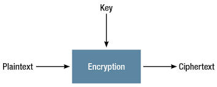

**Cipher**
===========
Definition
-----------
In cryptography, a cipher is an algorithm for performing encryption or decryption—a series of well-defined steps that can be followed as a procedure. An alternative, less common term is encipherment. To encipher or encode is to convert information into cipher or code.
In summary, cipher is a process of encrypting text into cipher (encoded messages) with a specified algorithm key.

Diagram
--------

    
Gameplay Examples
------------------
.. note::
    The Gameplay UI is still under active development.
    *Temporarily* only instruction, diagram or snapshots available. 
