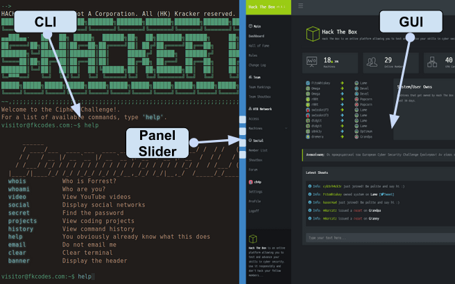

**CLI (Command Line Interfaces)**
==================================
Definition
-----------
A command-line interpreter or command-line processor uses a command-line interface to receive commands from a user in the form of lines of text. This provides a means of setting parameters for the environment, invoking executables and providing information to them as to what actions they are to perform.

Gameplay UI (User Interfaces)
------------------------------

