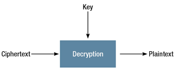

**Decipher**
=============
Definition
-----------
To discover the meaning of something hard to understand or which contains a hidden message. Decoding messages from cipher text into decipher text. In summary, Decipher is the process of decrypting cipher into text using the proper algorithm key. 

Diagram
--------

Gameplay Examples
------------------

.. note::
    The Gameplay UI is still under development.
    *Temporarily* only instruction, diagram or snapshots available. 
