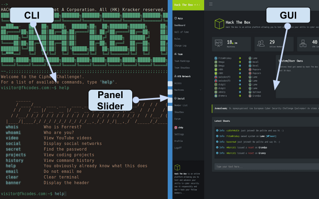

**GUI (Graphic User Interfaces)**
==================================
Definition
------------
The GUI, graphical user interface, is a form of user interface that allows users to interact with electronic devices through graphical icons and audio indicator such as primary notation, instead of text-based UIs

Gameplay UI (User Interfaces)
-------------------------------

