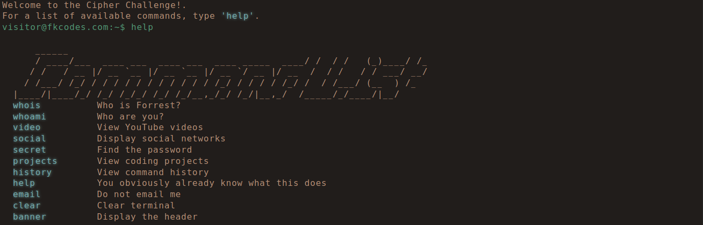

**Syntax**
===========
Definition
-----------
In computer science, the syntax of a computer language is the rules that define the combinations of symbols that are considered to be correctly structured statements or expressions in that language.

Gameplay CLI (Command Line Interfaces)
---------------------------------------
Users can display the available commands syntax by typing command ``help`` on the input box of the :doc:`cli`.

.. note::
    The Gameplay UI is still under development.
    *Temporarily* only instruction and snapshots available. 
